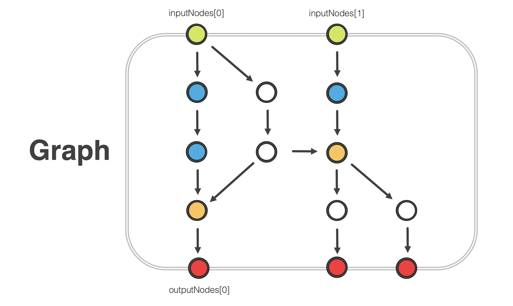

# Stream processing graph

## What it is?

## Main concepts

### Record, Stream and Dataset

**Record** is a group of key-value pairs. It represents a single unit of data - info about one person, one document, etc. In our project it is implemented by [Record](src/main/java/io/github/javaasasecondlanguage/homework01/Record.java) class. 

A sequence of records is called a **Stream**. Processing graph can accept stream of records as input, transform records one by one and then output them as a new stream.  

Streams can represent one of the two different concepts:
* Infinite sequence of records, which are generated in a real time. For example, clicks on items in the online store. You can never hope to see "all" such records, because they continue to arrive again and again. 
* Finite sequence of records. For example, contents of all documents currently present in a library. We will call such finite sequence a **Dataset**. 

In order to mark the end of a dataset, we can insert a so called **terminal record**.     

### Operator

**Operators** represent basic actions, which transform records in some way. They can be chained together in order to implement a graph with a desired logic. All operators must implement [Operator](src/main/java/io/github/javaasasecondlanguage/homework01/ops/Operator.java) interface.

Operator accepts records one at a time. Each time it can output either zero, one or more records (by passing them to `collector` object). Operator can store any info about previously seen rows inside itself.      

Operators can be roughly divided into two types: mappers and reducers.

#### Mapper

Mapper operator accepts a single record and outputs one or more new records. 

#### Reducer

Reducer operator accepts a sorted sequence of records, groups them by certain keys and outputs one or more new records for each group.

### Node

Each operator is contained inside a [ProcNode](src/main/java/io/github/javaasasecondlanguage/homework01/nodes/ProcNode.java) object. Node handles all communication with the outside world: 
* It accepts records from the previous nodes.
* Gives them to operator
* Collects its outputs
* Passes thse outputs to the next nodes.

Each node has several input **gates**, which allows it to accept different streams of records (this is used in join operations, for example).  
   
Nodes can be roughly divided into four types:
* [MapperNode](src/main/java/io/github/javaasasecondlanguage/homework01/nodes/MapperNode.java) skips terminal records. When a terminal record arrives, it is simply redirected to the next node without any processing.
* [ReducerNode](src/main/java/io/github/javaasasecondlanguage/homework01/nodes/ReducerNode.java) does not skip terminal records.
* [JoinerNode](src/main/java/io/github/javaasasecondlanguage/homework01/nodes/JoinerNode.java) accepts inputs from two gates (0 and 1). 
* [SorterNode](src/main/java/io/github/javaasasecondlanguage/homework01/nodes/SorterNode.java)
   
  

### Graph

[ProcGraph](src/main/java/io/github/javaasasecondlanguage/homework01/ProcGraph.java) object represents the actual processing graph - a group of interconnected nodes. It exposes its input nodes and output nodes.  
 

### Graph part builder

Since graph is a non-linear data structure, it is difficult to create a convenient API for assembling a new graph. In this project we solve this problem by using a [GraphPartBuilder](/src/main/java/io/github/javaasasecondlanguage/homework01/GraphPartBuilder.java). Each builder instance tracks the first and the last node of some linear part of the graph. You can do three basic actions with a builder:

* Append a new node to the current linear part (by using `map`, `reduce` and so on).
* Merge with another linear part, which is represented by another builder (by using `join`).
* Split a new linear part, creating a new builder (by using `branch`).  
  

## Our project

### Visualization

## Your task

Your task can be divided into two parts:
* Develop a "library" of operators.
* Use these operators to assemble processing graphs for solving actual practical problems.

### Operators library

You must implement the following operators (and pass tests for them):
* Mappers
* Reducers
* Joiners
    - InnerJoiner
    
### Practical problems

#### Problem 1
#### Problem 2

## Score

## Build and test
 